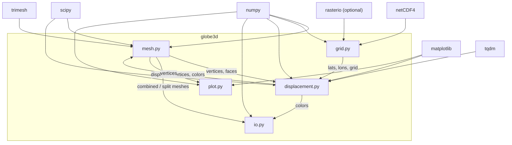
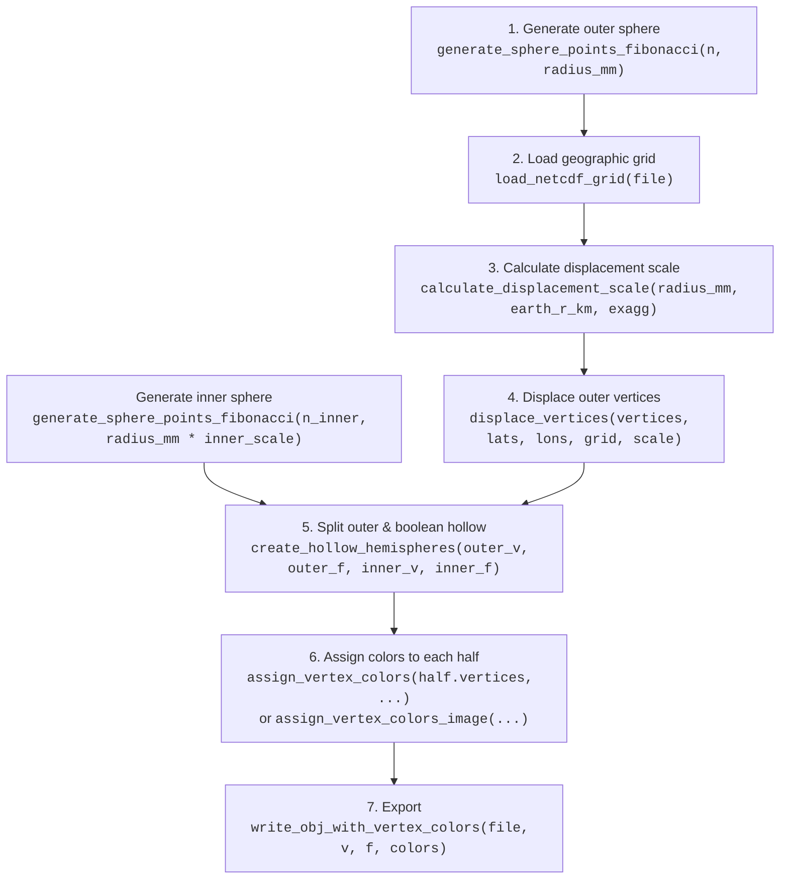

# Developer Guide — globe3d

Welcome to the `globe3d` project. This guide provides a comprehensive architectural walkthrough of the library, its modules, the data pipeline from raw geographic grids to 3D-printable models, and the conventions that keep the codebase healthy.

> **See also:** The repository-level [`AGENTS.md`](AGENTS.md) contains environment setup, Conda activation instructions, and CI/testing commands.

---

## 📖 Overview

`globe3d` is a Python package that turns geographic grid data (elevation, seismic tomography, or any other spherical field) into physical, 3D-printable globe models with exaggerated topography and optional vertex coloring. The typical output is a pair of OBJ hemisphere files, ready for full-color FDM or SLA printing.

### Key capabilities

| Capability | Module | Entry Point(s) |
|---|---|---|
| Sphere mesh generation (Fibonacci & icosahedron) | `mesh.py` | `generate_sphere_points_fibonacci`, `generate_sphere_points_icosahedron` |
| Geographic grid loading (NetCDF & TIFF) | `grid.py` | `load_netcdf_grid`, `load_tiff_grid`, `list_netcdf_variables` |
| Radial displacement of vertices | `displacement.py` | `displace_vertices`, `calculate_displacement_scale` |
| Vertex coloring (grid-based & image-based) | `displacement.py` | `assign_vertex_colors`, `assign_vertex_colors_image` |
| Mesh hollowing & hemisphere splitting | `mesh.py` | `create_hollow_hemispheres`, `combine_subtractive_globes`, `hollow_mesh`, `split_mesh_hemispheres` |
| Mesh utilities (resize, re-project, chirality) | `mesh.py` | `resize_globe`, `project_vertices_to_sphere`, `invert_chirality`, `compute_scale_factor` |
| File export (STL & OBJ with vertex colors) | `io.py` | `write_stl_binary`, `write_obj_with_vertex_colors` |
| Visual QA | `plot.py` | `plot_vertex_distribution` |

---

## 🏗️ Architecture

### Project layout

```
3D_globes/
├── AGENTS.md                  # Environment & CI guidance for agents
├── DEVELOPER_GUIDE.md         # ← you are here
├── README.md
├── pyproject.toml             # Build config (setuptools)
├── setup.py                   # Shim for editable installs
├── src/
│   └── globe3d/
│       ├── __init__.py        # Public API re-exports
│       ├── mesh.py            # Sphere generation, hollowing, splitting
│       ├── grid.py            # NetCDF / TIFF data loading
│       ├── displacement.py    # Vertex displacement & coloring
│       ├── io.py              # STL & OBJ export
│       └── plot.py            # Matplotlib visual checks
├── tests/
│   ├── test_mesh.py
│   ├── test_displacement.py
│   └── test_grid.py
└── notebooks/
    ├── tomo_globe_3d.ipynb          # Tomography globe (grid-colored)
    └── demo_split_globe_image.ipynb # Image-colored demo
```

### Dependency graph



Modules are intentionally loosely coupled: `grid.py` knows nothing about meshes, `displacement.py` knows nothing about file formats, and `io.py` knows nothing about grids. Communication happens through numpy arrays passed by the caller (typically a notebook).

---

## 🔬 Module-by-Module Reference

### `mesh.py` — Geometry Generation & Processing

This is the largest module (~413 lines) and carries all geometry logic. It has **no dependency on geographic data** — it operates purely on 3D vertex arrays and face index arrays.

#### Sphere generation strategies

| Function | Algorithm | Vertex count control | Notes |
|---|---|---|---|
| `generate_sphere_points_fibonacci(n_points, radius, center)` | [Fibonacci lattice](https://en.wikipedia.org/wiki/Fibonacci_lattice) | Exact (`n_points`) | Near-uniform density; faces computed via `scipy.spatial.ConvexHull`. Preferred for production globes (e.g. 1 million points). |
| `generate_sphere_points_icosahedron(subdivisions, radius, center)` | Recursive midpoint subdivision of an icosahedron | Grows as `10 × 4^s + 2` where `s` = subdivisions | Perfectly uniform triangle area; vertex count grows exponentially. |

Both return `(vertices, faces)` where `vertices` is `(N, 3)` float64 and `faces` is `(F, 3)` int32. Both generators call `trimesh.fix_normals()` internally to guarantee outward-facing winding order.

> [!NOTE]
> `scipy.spatial.ConvexHull` (used by the Fibonacci generator) does **not** guarantee consistent face winding. Without the `fix_normals` post-processing, the resulting mesh can have negative volume (inward-facing normals), which causes slicer artefacts and boolean operation failures.

**Internal helpers** (not exported through `__init__.py`):
- `create_icosahedron(radius, center)` — creates the base 12-vertex / 20-face icosahedron.
- `subdivide_icosahedron(vertices, faces, radius, center)` — one level of Loop-style subdivision with a midpoint cache to prevent duplicate vertices.
- `midpoint(v1, v2)` — simple vector average.
- `project_vertices_to_sphere(vertices, radius, center)` — re-normalises a set of vertices back onto an ideal sphere. Useful after operations that may have perturbed exact radii.

#### Mesh manipulation utilities

| Function | Purpose |
|---|---|
| `resize_globe(vertices, scale, origin)` | Scales vertices relative to a given origin point. |
| `invert_chirality(faces)` | Reverses the winding order (columns 1 and 2 swapped) of every triangle. This flips all face normals. |
| `compute_scale_factor(vertices, desired_cube_size)` | Calculates a uniform scale factor to fit a vertex cloud inside a bounding cube of a desired side length. |

#### Hollowing

There are **three hollowing strategies**, suited to different use cases:

1. **Boolean hemisphere pipeline** (`create_hollow_hemispheres`) — **The recommended approach for 3D printing.** Splits the displaced outer mesh into two capped hemispheres *first*, then boolean-subtracts the inner sphere from each half using `trimesh.boolean.difference`. This produces properly manifold, watertight hollow hemispheres with correct annular cap faces. Supports optional cap refinement via `max_cap_edge` (subdivides large cap triangles using `trimesh.remesh.subdivide_to_size`).

2. **Subtractive combination** (`combine_subtractive_globes`) — A fast, deterministic approach that concatenates outer and inner face arrays with inverted chirality on the inner shell. Suitable for **whole-globe visualisation** (e.g. viewing in MeshLab) but **not for split-and-print workflows** — see warning below.

3. **Boolean difference** (`hollow_mesh`) — Uses `trimesh.boolean.difference` on the whole globe. More geometrically correct than subtractive combination but significantly slower. Accepts optional pre-built inner mesh data, or generates one automatically via `create_inner_mesh`.

> [!WARNING]
> **Do not combine `combine_subtractive_globes` with `split_mesh_hemispheres` for 3D printing.** When `slice_plane(cap=True)` cuts a pre-hollowed mesh, the cap fills the entire cross-section (both outer and inner circles), sealing the inner cavity. The slicer then treats the hemisphere as solid. Use `create_hollow_hemispheres` instead, which splits *before* hollowing.

`create_inner_mesh(outer_vertices, outer_faces, thickness)` scales the outer mesh down about its bounding-box centre so that the thinnest wall is `thickness` units.

#### Hemisphere splitting

`split_mesh_hemispheres(mesh, normal, origin)` uses `trimesh.Trimesh.slice_plane` to cut a mesh into two halves along a plane (default: the equator, `normal=(0,0,1)`). Both halves are **capped** so they can be printed flat-side-down.

> [!NOTE]
> For hollow globe printing, prefer `create_hollow_hemispheres` which handles splitting *and* hollowing in the correct order.

---

### `grid.py` — Data Loading

A thin, focused module (~63 lines) responsible for reading geographic grids into the `(lats, lons, grid)` triple that the rest of the library consumes.

| Function | Format | Notes |
|---|---|---|
| `list_netcdf_variables(filename)` | NetCDF4 | Convenience helper: returns a list of variable name strings in the file. |
| `load_netcdf_grid(filename, lat_var, lon_var, data_var)` | NetCDF4 | Default variable names are `lat`, `lon`, `z` (matching ETOPO conventions). Caller must supply the correct names for other datasets (e.g. `y`, `x`, `z` for GMT grids). |
| `load_tiff_grid(filename)` | GeoTIFF | Reads the first band. Assumes an equirectangular projection spanning -180°→180° longitude, 90°→-90° latitude. Requires `rasterio`. |

All loaders return:
- `lats`: 1-D array, **must be sorted** (ascending) for `RegularGridInterpolator`.
- `lons`: 1-D array, sorted ascending.
- `grid`: 2-D array of shape `(len(lats), len(lons))`.

---

### `displacement.py` — Radial Displacement & Vertex Coloring

This is where the geographic data meets the 3D geometry (~229 lines).

#### Coordinate conventions

The library uses a right-handed Cartesian system centred at the origin:
- **x** → 0° longitude (prime meridian)
- **y** → 90° E longitude
- **z** → north pole

Conversion from Cartesian to geographic:
```
r   = ‖(x, y, z)‖
lat = arcsin(z / r)       (degrees)
lon = atan2(y, x)          (degrees)
```

This convention is consistent across `displace_vertices`, `assign_vertex_colors`, `assign_vertex_colors_image`, and `plot_vertex_distribution`.

#### Dateline wrapping (`_wrap_longitude`)

An internal helper that pads the longitude axis and grid to handle interpolation across the ±180° dateline. It replicates the first/last column of the grid at the opposite boundary with appropriate longitude offsets so that `RegularGridInterpolator` has continuous data across the seam.

#### Displacement pipeline

```python
scale = calculate_displacement_scale(model_radius_mm, earth_radius_km, vertical_exagg)
vertices = displace_vertices(vertices, lats, lons, grid, scale)
```

**`calculate_displacement_scale(model_radius_mm, earth_radius_km, vertical_exagg)`**

Computes: `(model_radius_mm / (earth_radius_km × 1000)) × vertical_exagg`

This converts real-world elevation values (in metres, relative to the reference radius) into millimetre-scale displacements on the model, multiplied by the vertical exaggeration factor. Typical exaggeration values for a printable globe are 20–50×.

**`displace_vertices(vertices, lats, lons, grid, scale, ...)`**

For each vertex:
1. Compute current radius `r` and geographic coordinates `(lat, lon)`.
2. Interpolate the grid value at `(lat, lon)` using `scipy.interpolate.RegularGridInterpolator`.
3. Compute new radius: `r_new = r + scale × grid_value`.
4. Rescale the vertex: `vertex_new = unit_vector × r_new`.

Supports chunked processing with a `tqdm` progress bar (controlled by `show_progress` and `chunk_size` parameters). The interpolation method can be changed via `interp_method` (default: `'linear'`).

#### Vertex coloring

Two independent coloring strategies:

**`assign_vertex_colors(vertices, lats, lons, grid, colormap, norm, vmin, vmax, ...)`**

Samples a *different* grid (e.g. seismic velocity anomaly) at each vertex's geographic location via `RegularGridInterpolator`, normalises the value, and maps it through a `matplotlib` colormap. Supports:
- Custom `Normalize` objects (e.g. `BoundaryNorm` for discrete classes).
- Custom `vmin`/`vmax` for linear normalisation.
- Both named colormaps (`'viridis'`) and `Colormap` objects (including discretised ones via `plt.get_cmap('RdBu_r', 7)`).

Returns `(N, 3)` RGB float64 array in [0, 1].

**`assign_vertex_colors_image(vertices, image_path, ...)`**

Samples an **equirectangular image file** at each vertex using nearest-neighbour lookup. The image coordinate mapping is:
```
v = (90 - lat) / 180 × (height - 1)    (row index, north→south)
u = (lon + 180) / 360 × (width - 1)    (column index, west→east)
```

Handles uint8, float, grayscale, and RGBA inputs automatically. Returns `(N, 3)` RGB float64 in [0, 1].

---

### `io.py` — File Export

Two export formats (~96 lines), chosen based on whether vertex colors are needed:

#### `write_stl_binary(filename, vertices, faces)`

Writes a standard binary STL. Each triangle is stored with its computed face normal (cross product of two edge vectors). No color support — suitable for single-material prints.

#### `write_obj_with_vertex_colors(filename, vertices, faces, colors, center)`

Writes an OBJ file using the vertex-color extension (`v x y z r g b`). Before writing, it calls `fix_face_chirality` to ensure all face normals point outward relative to `center`. OBJ indices are 1-based.

**Internal helper:**

`fix_face_chirality(vertices, faces, center)` iterates over every face, computes the face normal via cross product, and checks whether the normal points toward or away from `center` (via dot product with the centroid-to-centre vector). Faces pointing inward are flipped by swapping the last two vertex indices.

---

### `plot.py` — Visual QA

A single utility function (~31 lines):

**`plot_vertex_distribution(vertices, title, sample_size)`**

Converts vertex positions to `(lat, lon)` and plots them as a scatter plot. For large meshes, a random subset of `sample_size` points is shown to keep rendering fast.

---

### `__init__.py` — Public API

Re-exports all user-facing functions from the four core modules. The `__all__` list controls star-imports. Only the following are considered public API:

From **mesh**: `generate_sphere_points_fibonacci`, `generate_sphere_points_icosahedron`, `resize_globe`, `hollow_mesh`, `combine_subtractive_globes`, `compute_scale_factor`, `invert_chirality`, `split_mesh_hemispheres`, `create_hollow_hemispheres`

From **grid**: `list_netcdf_variables`, `load_netcdf_grid`, `load_tiff_grid`

From **displacement**: `displace_vertices`, `assign_vertex_colors`, `assign_vertex_colors_image`, `calculate_displacement_scale`

From **io**: `write_stl_binary`, `write_obj_with_vertex_colors`

From **plot**: `plot_vertex_distribution`

Internal helpers (`create_icosahedron`, `subdivide_icosahedron`, `midpoint`, `project_vertices_to_sphere`, `create_inner_mesh`, `fix_face_chirality`, `_wrap_longitude`) are **not** exported and should not be imported directly by users.

---

## 🔄 End-to-End Pipeline

The following diagram shows the full data-flow for producing a 3D-printable, colored, hollow, split globe:



### Step-by-step (with reference parameters)

#### 1. Generate base spheres

```python
outer_vertices, outer_faces = generate_sphere_points_fibonacci(1_000_000, model_radius_mm)
inner_vertices, inner_faces = generate_sphere_points_fibonacci(20_000, model_radius_mm * 0.8)
```

The outer sphere uses a high vertex count for surface detail; the inner sphere can be much coarser since it only defines the void boundary. `inner_scale` (0.8 here) controls wall thickness as a fraction of the radius.

#### 2. Load the geographic grid

```python
topo_lats, topo_lons, topo_grid = load_netcdf_grid(
    "ETOPO_2022_v1_60s_N90W180_surface.nc",
    lat_var='lat', lon_var='lon', data_var='z'
)
```

For the coloring grid (if separate from the displacement grid):

```python
c_lats, c_lons, c_grid = load_netcdf_grid(
    "s40_depth_slice_2850.grd",
    lat_var='y', lon_var='x', data_var='z'
)
```

#### 3. Calculate displacement scale

```python
scale = calculate_displacement_scale(model_radius_mm, earth_radius_km=6371.0, vertical_exagg=30)
```

#### 4. Displace outer vertices

```python
outer_vertices = displace_vertices(
    outer_vertices, topo_lats, topo_lons, topo_grid, scale, show_progress=True
)
```

Only the outer shell is displaced. The inner shell remains a smooth sphere.

#### 5. Split and hollow into hemispheres

```python
top_half, bottom_half = create_hollow_hemispheres(
    outer_vertices, outer_faces,
    inner_vertices, inner_faces,
    max_cap_edge=2.0,      # optional: refine cap triangles to ≤2mm edges
    engine='manifold'       # recommended boolean engine
)
```

This single call handles the correct order of operations internally:
1. Splits the displaced outer shell at the equator with a capped plane cut.
2. Optionally subdivides the large cap triangles (if `max_cap_edge` is set).
3. Boolean-subtracts the smooth inner sphere from each half.
4. Returns two watertight, manifold hollow hemispheres.

> [!TIP]
> For a 40mm-radius globe with 1M outer points, a `max_cap_edge` of 2.0 mm is a good default. Surface edges are already ~0.15mm, so only the cap triangles are affected.

#### 6. Color each hemisphere

Colors should be applied **after** splitting because the split operation creates new vertices at the cut plane that weren't in the original mesh.

```python
# Grid-based coloring
top_colors = assign_vertex_colors(
    top_half.vertices, c_lats, c_lons, c_grid,
    colormap=plt.get_cmap('RdBu_r', 7), vmin=-2, vmax=2
)

# OR image-based coloring
top_colors = assign_vertex_colors_image(top_half.vertices, 'earth_texture.png')
```

#### 7. Export

```python
write_obj_with_vertex_colors('globe_top.obj', top_half.vertices, top_half.faces, top_colors)
write_obj_with_vertex_colors('globe_bottom.obj', bottom_half.vertices, bottom_half.faces, bottom_colors)
```

---

## 📓 Notebook Workflows

Two example notebooks live in `notebooks/`:

### `tomo_globe_3d.ipynb`

Demonstrates the **tomography globe** workflow — a globe with ETOPO topography displacement and vertex colors derived from a seismic tomography depth slice (e.g. S40RTS at 2850 km depth). This notebook uses `assign_vertex_colors` with:
- A `BoundaryNorm` for discrete classification (`blue / white / red`), or
- A discretised continuous colormap (`plt.get_cmap('RdBu_r', 7)`).

The notebook includes a 2D preview (`pcolormesh`) of the color grid before applying it to the 3D model.

### `demo_split_globe_image.ipynb`

Demonstrates **image-based coloring** using `assign_vertex_colors_image`. It programmatically generates a test equirectangular gradient image, generates a displaced sphere, hollows it using the subtractive approach with `resize_globe` and `combine_subtractive_globes`, splits it, and exports as OBJ.

Both notebooks use `%autoreload 2` for iterative development.

---

## 📐 Key Concepts & Design Decisions

### Coordinate system

The library uses a **right-handed Cartesian** system centred at the origin, with the z-axis through the north pole. This matches the mathematical convention for spherical coordinates and ensures consistency with `ConvexHull` and `trimesh`.

### Units

The canonical working unit is **millimetres** for model space (radii, displacements) because 3D printers universally use mm. Real-world data is assumed to be in **metres** for elevation / depth (the standard for datasets like ETOPO). The `calculate_displacement_scale` function handles the km→m→mm conversion internally.

### Why three hollowing approaches?

**Boolean hemisphere pipeline** (`create_hollow_hemispheres`) is the recommended approach for 3D printing. It splits the outer mesh first, then boolean-subtracts the inner sphere from each half. This produces properly manifold, watertight hemispheres. The boolean operation is performed by the `manifold3d` engine (or Blender as a fallback).

**Subtractive combination** (`combine_subtractive_globes`) is fast and deterministic — it simply concatenates vertex and face arrays with inverted chirality on the inner shell. It produces a mesh that *looks* hollow and is suitable for whole-globe visualisation. However, **it cannot be combined with `split_mesh_hemispheres`** for 3D printing because the equatorial cap seals the inner cavity.

**Boolean difference** (`hollow_mesh`) performs a whole-globe boolean subtraction. Useful for exporting a complete hollow globe without splitting, but slower and more fragile than the subtractive approach.

### Face chirality

In STL and OBJ, the **winding order** of a triangle's vertices determines the direction of its face normal (right-hand rule). Outward-pointing normals are essential for correct slicer behaviour. The library handles this in several places:
1. `generate_sphere_points_fibonacci` / `generate_sphere_points_icosahedron` — call `trimesh.fix_normals()` after face generation to guarantee outward normals.
2. `invert_chirality` — used by `combine_subtractive_globes` to flip the inner shell's normals inward.
3. `fix_face_chirality` — used by `write_obj_with_vertex_colors` to post-process all faces, ensuring normals point away from the sphere centre.
4. `create_hollow_hemispheres` — calls `fix_normals()` on both input meshes before boolean operations.

### Vertex colors in OBJ

The OBJ format does not have a formal vertex color standard, but a widely supported convention appends `r g b` values to each `v` line: `v x y z r g b`. This is supported by MeshLab, Blender, and PrusaSlicer / BambuStudio / OrcaSlicer.

### Fibonacci vs icosahedron

| | Fibonacci | Icosahedron |
|---|---|---|
| **Density uniformity** | Very good (near-uniform) | Excellent (exactly uniform triangles) |
| **Vertex count control** | Continuous (any `n`) | Discrete (exponential growth with subdivisions) |
| **Typical use** | High-resolution production globes | Lower-resolution or algorithmically regular meshes |
| **Face generation** | `ConvexHull` (may produce slivers near poles) | Recursive subdivision (all triangles similar) |

For 3D printing, the Fibonacci lattice at ~1M points is the standard choice.

---

## 🧪 Testing

The test suite lives in `tests/` and uses `pytest`.

### Test coverage by module

| Test file | Module | Key tests |
|---|---|---|
| `test_mesh.py` | `mesh.py` | Fibonacci generation (vertex count, radii), icosahedron subdivision, outward-facing normals (positive volume), `resize_globe`, `compute_scale_factor`, `project_vertices_to_sphere`, `create_inner_mesh`, `split_mesh_hemispheres` (watertightness, z-bounds), `create_hollow_hemispheres` (watertight, correct volume, z-bounds) |
| `test_displacement.py` | `displacement.py` | `displace_vertices` (constant grid → predictable radius change), `assign_vertex_colors` (output shape & range), `assign_vertex_colors_image` (mocked image, coordinate mapping) |
| `test_grid.py` | `grid.py` | `list_netcdf_variables` and `load_netcdf_grid` using mocked `netCDF4.Dataset` |

### Running tests

```bash
conda activate pygmt
pytest
```

### Testing philosophy

- External data dependencies (NetCDF files, images) are **mocked** so tests run without large data files.
- Geometry tests verify invariants (e.g. all vertices lie on the sphere, bounding box shrinks after inner mesh creation) rather than comparing exact floating-point coordinates.
- The `io.py` module currently has **no dedicated tests** — this is a known coverage gap.

---

## 🤝 Keeping Documentation Live

Both this `DEVELOPER_GUIDE.md` and the repository-level `AGENTS.md` must be kept up-to-date with any structural or architectural changes. When you:

- Add or rename a public function → update the module reference table and `__init__.py` exports list in this guide.
- Change the pipeline order or add a new step → update the pipeline diagram and step-by-step walkthrough.
- Introduce a new module → add a section under "Module-by-Module Reference" and update the dependency graph.
- Change testing patterns or add a test file → update the testing section.

Future agents and contributors should review both documents to quickly onboard onto the project.
