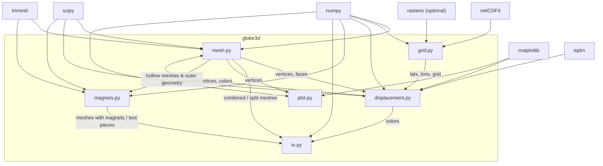
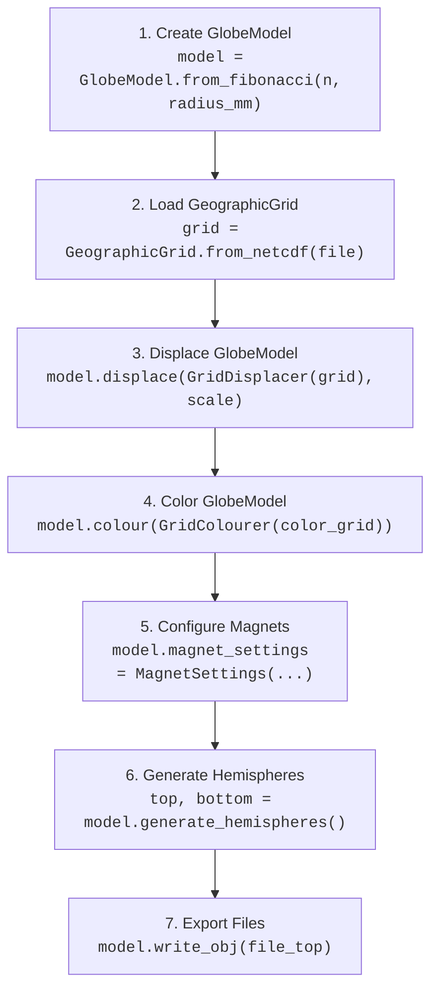

# Developer Guide — globe3d

Welcome to the `globe3d` project. This guide provides a comprehensive architectural walkthrough of the library, its modules, the data pipeline from raw geographic grids to 3D-printable models, and the conventions that keep the codebase healthy.

> **See also:** The repository-level [`AGENTS.md`](AGENTS.md) contains environment setup, Conda activation instructions, and CI/testing commands.

---

## 📖 Overview

`globe3d` is a Python package that turns geographic grid data (elevation, seismic tomography, or any other spherical field) into physical, 3D-printable globe models with exaggerated topography and optional vertex coloring. The typical output is a pair of OBJ hemisphere files, ready for full-color FDM or SLA printing.

### Key capabilities

| Capability | Module / Class | Entry Point(s) / Methods |
|---|---|---|
| Globe model state & orchestration | `mesh.py` / `GlobeModel` | `GlobeModel.from_fibonacci`, `GlobeModel.from_icosahedron`, `GlobeModel.displace`, `GlobeModel.colour`, `GlobeModel.generate_hemispheres` |
| Geographic grid loading & representation | `grid.py` / `GeographicGrid` | `GeographicGrid.from_netcdf`, `GeographicGrid.from_tiff`, `GeographicGrid.list_netcdf_variables` |
| Radial displacement of vertices | `displacement.py` / `Displacer` | `GridDisplacer`, `PointDisplacer`, `LineDisplacer`, `PolygonDisplacer` |
| Vertex coloring (grid, image, constant) | `displacement.py` / `Colourer` | `GridColourer`, `ImageColourer`, `ConstantColourer` |
| Magnet settings & placement options | `magnets.py` / `MagnetSettings` | `MagnetSettings` |
| File export (STL & OBJ with vertex colors) | `mesh.py` / `GlobeModel` | `GlobeModel.write_stl`, `GlobeModel.write_obj` |
| Visual QA | `plot.py` | `plot_vertex_distribution` |

---

## 🏗️ Architecture

### Project layout

```
3D_globes/
├── AGENTS.md                  # Environment & CI guidance for agents
├── DEVELOPER_GUIDE.md         # ← you are here
├── README.md
├── pyproject.toml             # Build config (setuptools)
├── setup.py
├── src/
│   └── globe3d/
│       ├── __init__.py        # Public API re-exports
│       ├── mesh.py            # Sphere generation, hollowing, splitting
│       ├── grid.py            # NetCDF / TIFF data loading
│       ├── displacement.py    # Vertex displacement & coloring
│       ├── magnets.py         # Optimization & insertion of magnets
│       ├── io.py              # STL & OBJ export
│       └── plot.py            # Matplotlib visual checks
├── tests/
│   ├── test_mesh.py
│   ├── test_displacement.py
│   ├── test_grid.py
│   └── test_magnets.py
└── examples/
    ├── tomo_globe_3d.ipynb          # Tomography globe (grid-colored)
    ├── demo_split_globe_image.ipynb # Image-colored demo
    └── demo_magnets.ipynb           # Magnet insertion demo
```

### Dependency graph



Modules are intentionally loosely coupled: `grid.py` knows nothing about meshes, `displacement.py` knows nothing about file formats, and `io.py` knows nothing about grids. Communication happens through numpy arrays passed by the caller (typically a notebook).

---

## 🔬 Module-by-Module Reference

### `mesh.py` — Geometry Generation & Processing

This module defines the central **`GlobeModel`** class, which encapsulates the outer/inner geometry, styling, recipe, and export orchestration of the globe.

#### `GlobeModel` Initialization & Creators

- `GlobeModel(vertices=None, faces=None)`: Creates a new model instance.
- `GlobeModel.from_fibonacci(n_points, radius=1.0, center=(0.0, 0.0, 0.0))`: Generates a base sphere mesh using a Fibonacci lattice.
- `GlobeModel.from_icosahedron(subdivisions, radius=1.0, center=(0.0, 0.0, 0.0))`: Generates a base sphere mesh by recursively subdividing an icosahedron.

Both generators call `trimesh.fix_normals()` internally to guarantee outward-facing winding order.

#### `GlobeModel` Workflow Methods

- `model.displace(displacer, scale=1.0)`: Applies a `Displacer` object to the outer vertices.
- `model.colour(colourer, target='outer', selection=None, selection_kwargs=None)`: Applies a `Colourer` object to the model's vertices (optionally to a subset via a selection function).
- `model.create_inner_mesh(thickness)`: Scales down the outer mesh to create an inner cavity.
- `model.generate_hemispheres(plane_normal=(0,0,1), plane_origin=(0,0,0), hollow=True, thickness=1.5, engine=None)`: Splits and hollows the model, returning two `trimesh.Trimesh` halves. Re-applies the coloring recipe to the split hemispheres.
- `model.write_stl(filename, part='outer')`: Exports the specified part to a binary STL file.
- `model.write_obj(filename, part='outer', center=(0.0, 0.0, 0.0), fix_normals=False)`: Exports the specified part (with vertex colors) to an OBJ file.

#### Hollowing & Splitting Helpers (Internal)

- `create_hollow_hemispheres(...)`: Recommended split-first, hollow-second boolean engine pipeline.
- `combine_subtractive_globes(...)`: Fast and deterministic subtraction by concatenation and inverted chirality of inner shell.
- `hollow_mesh(...)`: Whole-globe boolean difference.
- `split_mesh_hemispheres(...)`: Splits and caps a mesh.

---

### `grid.py` — Geographic Grid Loading

This module defines the **`GeographicGrid`** class, representing geographic coordinates (`lats`, `lons`) and a 2D scalar grid of data. Coordinates are validated and automatically sorted in ascending order upon creation.

#### `GeographicGrid` Creators & Utilities

- `GeographicGrid(lats, lons, grid)`: Initializes a `GeographicGrid` and validates dimensions, uniqueness, and shape consistency.
- `GeographicGrid.from_netcdf(filename, lat_var='lat', lon_var='lon', data_var='z')`: Loads grid data from a NetCDF4 file.
- `GeographicGrid.from_tiff(filename)`: Loads grid data from a GeoTIFF file using `rasterio`.
- `GeographicGrid.list_netcdf_variables(filename)`: Static helper to list available variables in a NetCDF4 file.

---

### `displacement.py` — Radial Displacement & Vertex Coloring

This is where the geographic data meets the 3D geometry (~229 lines).

#### Coordinate conventions

The library uses a right-handed Cartesian system centred at the origin:
- **x** → 0° longitude (prime meridian)
- **y** → 90° E longitude
- **z** → north pole

Conversion from Cartesian to geographic:
```
r   = ‖(x, y, z)‖
lat = arcsin(z / r)       (degrees)
lon = atan2(y, x)          (degrees)
```

This convention is consistent across `displace_vertices`, `assign_vertex_colors`, `assign_vertex_colors_image`, and `plot_vertex_distribution`.

#### Dateline wrapping (`_wrap_longitude`)

An internal helper that pads the longitude axis and grid to handle interpolation across the ±180° dateline. It replicates the first/last column of the grid at the opposite boundary with appropriate longitude offsets so that `RegularGridInterpolator` has continuous data across the seam.
### `displacement.py` — Radial Displacement & Vertex Coloring

This module handles radial vertex displacement and vertex coloring using an object-oriented class hierarchy.

#### Displacer Hierarchy

All displacement classes inherit from the base `Displacer` class and are callable with `__call__(vertices, scale=1.0)`.

- **`GridDisplacer(grid, num_threads=-1, interp_method='linear')`**
  Displaces vertices radially based on a `GeographicGrid` interpolation.
- **`PointDisplacer(points_data, displacement, radius_degrees=1.0, num_threads=-1)`**
  Displaces vertices close to discrete points. `points_data` can be a shapefile path or an `(N, 2)` array of `(lon, lat)`.
- **`LineDisplacer(shapefile_path, displacement, width_degrees=1.0, num_threads=-1)`**
  Displaces vertices within a ribbon width of line features.
- **`PolygonDisplacer(shapefile_path, displacement, displace_inside=True, num_threads=-1)`**
  Displaces vertices that fall inside (or outside) closed polygons.

All displacement classes validate that no vertex is translated deeper than or to the origin (i.e. new radius <= 0), raising a `ValueError` if a displacement is invalid.

#### Colourer Hierarchy

All coloring classes inherit from the base `Colourer` class and are callable with `__call__(vertices)`. They return an `(N, 3)` RGB float64 array in range `[0, 1]`.

- **`GridColourer(grid, colormap='viridis', norm=None, vmin=None, vmax=None, num_threads=-1, interp_method='linear')`**
  Samples a geographic grid and maps the values through a Matplotlib colormap.
- **`ImageColourer(image_path)`**
  Maps an equirectangular image to the sphere vertices using nearest-neighbor lookup.
- **`ConstantColourer(color=[1.0, 1.0, 1.0])`**
  Applies a solid, single RGB color.

#### Selection Functions & Registry

- `select_inward_facing(vertices, faces)`: Identifies vertices belonging to inward-facing faces.
- `select_outward_facing(vertices, faces)`: Identifies vertices belonging to outward-facing faces.
- `register_selection_function(name, func)`: Registers a custom selection callable to the global `SELECTION_REGISTRY`. Registered names can be passed directly as strings to `model.colour()`.

---

### `magnets.py` — Magnet Insertion & Position Optimization

This module manages the placement and insertion of magnets into globe hemispheres so they can be magnetically assembled. It uses bisection search to find the optimal magnet positions directly from the outer 3D geometry of the globe, with no dependency on raw grids or scale parameters.

#### Position Optimization

**`optimize_magnet_positions(longitudes, outer_mesh, r_enc, h_boss, bisection_iters)`**

For each target longitude on the equatorial cut plane, this function uses a bisection search (binary search) to find the maximum distance $d$ from the origin where a boss cylinder of radius `r_enc` and height `h_boss` is completely contained within the outer sphere's displaced surface.
- Checks containment at multiple check-points on the top and bottom caps of the boss cylinder.
- Uses `outer_mesh.contains(global_pts)` to perform fast and precise geometric containment checks directly on the watertight displaced outer mesh.
- Returns a list of optimized `(x, y)` center coordinates.

**`find_valid_magnet_positions_no_bosses(outer_mesh, inner_mesh, r_enc, h_boss, step_degrees=2, n_magnets=3, min_magnets=2, min_angular_spacing=60.0, ...)`**

Steps around the model cut-plane in `step_degrees` increments and checks containment of a candidate magnet void completely within the solid shell of the hollowed globe (inside `outer_mesh` and outside `inner_mesh`). It then uses a backtracking optimization algorithm to find a subset of candidate angles that maximizes spacing uniformity while respecting `min_angular_spacing`. Raises `ValueError` if fewer than `min_magnets` can be placed.

#### Magnet Insertion

**`insert_magnets_into_hemispheres(top_mesh, bottom_mesh, outer_vertices, outer_faces, diameter, height, n_magnets, position, ...)`**

Orchestrates the boolean modification of the top and bottom hollow hemispheres:
1. Determines longitudes for the magnets (either a single start longitude with `n_magnets` spaced evenly, or a custom list of positions).
2. Optimizes the magnet centers on the XY cut plane:
   - If `add_bosses=True`, utilizes `optimize_magnet_positions`.
   - If `add_bosses=False` (magnet placement without adding material/bosses), utilizes `find_valid_magnet_positions_no_bosses` to find positions directly in the solid shell.
3. Generates the boss cylinders (if `add_bosses=True`) and void cylinders for each position:
   - For the top hemisphere, bosses are unioned (if added) and voids are subtracted from the solid shell.
   - For the bottom hemisphere, the same coordinate bosses are unioned (if added) and corresponding voids are subtracted.
4. Performs these boolean operations using the `trimesh` boolean module.
5. Returns a tuple of `(top_mesh_with_magnets, bottom_mesh_with_magnets)`.

#### Calibration Test Piece

**`generate_magnet_test_piece(diameter, height, horizontal_tolerance, vertical_tolerance, vertical_offset, min_thickness, output_path)`**

Generates a simple cylinder containing a single magnet void. Useful for test-printing to verify tolerances before printing a large globe.

---

### `io.py` — File Export

Two export formats (~96 lines), chosen based on whether vertex colors are needed:

#### `write_stl_binary(filename, vertices, faces)`

Writes a standard binary STL. Each triangle is stored with its computed face normal (cross product of two edge vectors). No color support — suitable for single-material prints.

#### `write_obj_with_vertex_colors(filename, vertices, faces, colors, center, fix_normals)`

Writes an OBJ file using the vertex-color extension (`v x y z r g b`). OBJ indices are 1-based.

> [!IMPORTANT]
> The `fix_normals` parameter defaults to **False**.  For manifold meshes from boolean operations (e.g. `create_hollow_hemispheres`), normals are already correct and must **not** be overridden — `fix_face_chirality` would flip the inner shell's faces outward, destroying the manifold and causing slicers to fill the hollow.  Set `fix_normals=True` only for simple convex meshes.

**Internal helper:**

`fix_face_chirality(vertices, faces, center)` iterates over every face, computes the face normal via cross product, and checks whether the normal points toward or away from `center` (via dot product with the centroid-to-centre vector). Faces pointing inward are flipped by swapping the last two vertex indices.

---

### `plot.py` — Visual QA

A single utility function (~31 lines):

**`plot_vertex_distribution(vertices, title, sample_size)`**

Converts vertex positions to `(lat, lon)` and plots them as a scatter plot. For large meshes, a random subset of `sample_size` points is shown to keep rendering fast.

---

### `__init__.py` — Public API

Re-exports the core OOP interface classes and helpers:

- **Classes**: `GeographicGrid`, `GlobeModel`, `MagnetSettings`, `Displacer`, `GridDisplacer`, `PointDisplacer`, `LineDisplacer`, `PolygonDisplacer`, `Colourer`, `GridColourer`, `ImageColourer`, `ConstantColourer`
- **Helpers & Registries**: `select_inward_facing`, `select_outward_facing`, `register_selection_function`, `cartesian_to_spherical`, `plot_vertex_distribution`

Internal helpers are not exported and should not be imported directly by users.

---

## 🔄 End-to-End Pipeline

The following diagram shows the full data-flow in v3.0 for producing a 3D-printable, colored, hollow, split globe using the new OOP interface:



### Step-by-step (with reference parameters)

#### 1. Generate base model

```python
from globe3d import GlobeModel, GeographicGrid, MagnetSettings
from globe3d import GridDisplacer, PointDisplacer, LineDisplacer, PolygonDisplacer
from globe3d import GridColourer, ImageColourer, ConstantColourer
import matplotlib.pyplot as plt

model_radius_mm = 50.0
model = GlobeModel.from_fibonacci(n_points=1_000_000, radius=model_radius_mm)
```

The outer sphere uses a high vertex count for surface detail. An inner mesh is generated automatically during hollowing.

#### 2. Load the geographic grid

```python
topo_grid = GeographicGrid.from_netcdf(
    "ETOPO_2022_v1_60s_N90W180_surface.nc",
    lat_var='lat', lon_var='lon', data_var='z'
)
```

For the coloring grid (if separate from the displacement grid):

```python
color_grid = GeographicGrid.from_netcdf(
    "s40_depth_slice_2850.grd",
    lat_var='y', lon_var='x', data_var='z'
)
```

#### 3. Displace outer vertices

```python
# Compute scale factor converts meters in ETOPO to mm on model:
vertical_exagg = 30.0
scale = (model_radius_mm / (6371.0 * 1000)) * vertical_exagg

# Apply GridDisplacer to the model
model.displace(GridDisplacer(topo_grid), scale=scale)
```

Only the outer shell is displaced. The inner shell remains a smooth sphere.

> [!IMPORTANT]
> **Displacement Validation**: All displacement classes validate that no vertex is translated deeper than or to the origin. If a negative displacement exceeds the vertex's current distance from the origin (new radius <= 0), a `ValueError` is raised.

#### 3.5. Specialized Shapefile & Coordinate Displacement (optional)

Depending on the geometry type, you can apply one of the specialized displacers:

##### A. Points & Coordinate Lists (`PointDisplacer`)
Displaces vertices close to discrete points (either a shapefile containing Point/MultiPoint geometries or an `(N, 2)` array/list of `(lon, lat)`):
```python
model.displace(PointDisplacer("../inputs/my_points.shp", displacement=1.5, radius_degrees=1.0))
```

##### B. Lines & Borders (`LineDisplacer`)
Displaces vertices close to line or polygon boundaries:
```python
model.displace(LineDisplacer("../inputs/coastlines/ne_110m_coastline.shp", displacement=1.0, width_degrees=0.5))
```

##### C. Closed Polygons (`PolygonDisplacer`)
Displaces vertices inside or outside closed polygons (Polygons/MultiPolygons):
```python
model.displace(PolygonDisplacer("../inputs/land/ne_110m_land.shp", displacement=1.0, displace_inside=True))
```

#### 4. Color the model

```python
# Grid-based coloring
colourer = GridColourer(color_grid, colormap=plt.get_cmap('RdBu_r', 7), vmin=-2, vmax=2)
model.colour(colourer)

# OR image-based coloring

Two example notebooks live in `examples/`:

### `tomo_globe_3d.ipynb`

Demonstrates the **tomography globe** workflow — a globe with ETOPO topography displacement, a 1mm step at the coastlines, and vertex colors derived from a seismic tomography depth slice (e.g. S40RTS at 2850 km depth). This notebook uses `assign_vertex_colors` with:
- A `BoundaryNorm` for discrete classification (`blue / white / red`), or
- A discretised continuous colormap (`plt.get_cmap('RdBu_r', 7)`).

The notebook includes a 2D preview (`pcolormesh`) of the color grid before applying it to the 3D model.

### `demo_split_globe_image.ipynb`

Demonstrates **image-based coloring** using `assign_vertex_colors_image`. It programmatically generates a test equirectangular gradient image, generates a displaced sphere, hollows it using the subtractive approach with `resize_globe` and `combine_subtractive_globes`, splits it, and exports as OBJ to the `outputs/` directory.

Both notebooks use `%autoreload 2` for iterative development.

---

## 📐 Key Concepts & Design Decisions

### Coordinate system

The library uses a **right-handed Cartesian** system centred at the origin, with the z-axis through the north pole. This matches the mathematical convention for spherical coordinates and ensures consistency with `ConvexHull` and `trimesh`.

### Units

The canonical working unit is **millimetres** for model space (radii, displacements) because 3D printers universally use mm. Real-world data is assumed to be in **metres** for elevation / depth (the standard for datasets like ETOPO). The `calculate_displacement_scale` function handles the km→m→mm conversion internally.

### Why three hollowing approaches?

**Boolean hemisphere pipeline** (`create_hollow_hemispheres`) is the recommended approach for 3D printing. It splits the outer mesh first, then boolean-subtracts the inner sphere from each half. This produces properly manifold, watertight hemispheres. The boolean operation is performed by the `manifold3d` engine (or Blender as a fallback).

**Subtractive combination** (`combine_subtractive_globes`) is fast and deterministic — it simply concatenates vertex and face arrays with inverted chirality on the inner shell. It produces a mesh that *looks* hollow and is suitable for whole-globe visualisation. However, **it cannot be combined with `split_mesh_hemispheres`** for 3D printing because the equatorial cap seals the inner cavity.

**Boolean difference** (`hollow_mesh`) performs a whole-globe boolean subtraction. Useful for exporting a complete hollow globe without splitting, but slower and more fragile than the subtractive approach.

### Face chirality

In STL and OBJ, the **winding order** of a triangle's vertices determines the direction of its face normal (right-hand rule). Outward-pointing normals are essential for correct slicer behaviour. The library handles this in several places:
1. `generate_sphere_points_fibonacci` / `generate_sphere_points_icosahedron` — use `_fix_sphere_normals()`, a fast vectorised dot-product check, to guarantee outward normals.
2. `invert_chirality` — used by `combine_subtractive_globes` to flip the inner shell's normals inward.
3. `fix_face_chirality` — available via `write_obj_with_vertex_colors(fix_normals=True)` for simple convex meshes. **Not applied by default** to avoid destroying manifold geometry from boolean operations.
4. `create_hollow_hemispheres` — calls `trimesh.fix_normals()` on both input meshes before boolean operations.

### Vertex colors in OBJ

The OBJ format does not have a formal vertex color standard, but a widely supported convention appends `r g b` values to each `v` line: `v x y z r g b`. This is supported by MeshLab, Blender, and PrusaSlicer / BambuStudio / OrcaSlicer.

### Fibonacci vs icosahedron

| | Fibonacci | Icosahedron |
|---|---|---|
| **Density uniformity** | Very good (near-uniform) | Excellent (exactly uniform triangles) |
| **Vertex count control** | Continuous (any `n`) | Discrete (exponential growth with subdivisions) |
| **Typical use** | High-resolution production globes | Lower-resolution or algorithmically regular meshes |
| **Face generation** | `ConvexHull` (may produce slivers near poles) | Recursive subdivision (all triangles similar) |

For 3D printing, the Fibonacci lattice at ~1M points is the standard choice.

---

## 🧪 Testing

The test suite lives in `tests/` and uses `pytest`.

### Test coverage by module

| Test file | Module | Key tests |
|---|---|---|
| `test_mesh.py` | `mesh.py` | Fibonacci generation (vertex count, radii), icosahedron subdivision, outward-facing normals (positive volume), `resize_globe`, `compute_scale_factor`, `project_vertices_to_sphere`, `create_inner_mesh`, `split_mesh_hemispheres` (watertightness, z-bounds), `create_hollow_hemispheres` (watertight, correct volume, z-bounds) |
| `test_displacement.py` | `displacement.py` | `displace_vertices` (constant grid → predictable radius change), `assign_vertex_colors` (output shape & range), `assign_vertex_colors_image` (mocked image, coordinate mapping) |
| `test_grid.py` | `grid.py` | `list_netcdf_variables` and `load_netcdf_grid` using mocked `netCDF4.Dataset` |
| `test_io.py` | `io.py` | `write_stl_binary` (binary validation, size check, normals), `fix_face_chirality` (vectorized chirality checking), `write_obj_with_vertex_colors` (correct format, lines count) |
| `test_magnets.py` | `magnets.py` | `optimize_magnet_positions` (bisection distance check), `insert_magnets_into_hemispheres` (watertightness, volume bounds), `generate_magnet_test_piece` (height/radius bounds, watertightness) |

### Running tests

```bash
conda activate pygmt
pytest
```

### Testing philosophy

- External data dependencies (NetCDF files, images) are **mocked** so tests run without large data files.
- Geometry tests verify invariants (e.g. all vertices lie on the sphere, bounding box shrinks after inner mesh creation) rather than comparing exact floating-point coordinates.

---

## ⚡ Performance Optimization (Vectorization & Parallelization)

To support high-resolution meshes (e.g., millions of vertices/faces) and rapid generation cycles, `globe3d` uses high-performance CPU optimizations:

### 1. Vectorized Geometry Generation
- Recursive subdivision (`subdivide_icosahedron`) and face normal alignment (`_fix_sphere_normals`, `fix_face_chirality`) are implemented using vectorized NumPy matrix operations. This avoids slow Python loops, reducing generation times for level 6/7 spheres to milliseconds.

### 2. Parallelized Grid Interpolation
- Geographic grid lookup and interpolation (`displace_vertices`, `assign_vertex_colors`, shapefile-based functions) are parallelized on the CPU using a `ThreadPoolExecutor` or `_parallel_sjoin`.
- All displacement functions accept a `num_threads` argument:
  - `num_threads=-1` (default): Uses all available CPU cores.
  - `num_threads=1`: Synchronous single-threaded execution.
  - `num_threads=N`: Restricts execution to `N` worker threads.

### 3. Vectorized File Writers
- `write_stl_binary`: Uses a structured NumPy array (`np.dtype`) to serialize and write binary STL facets in a single call to `file.write()`, accelerating disk I/O.
- `write_obj_with_vertex_colors`: Replaces slow loop-based file writing with `np.savetxt`, formatting and flushing coordinates, colors, and faces in bulk.

---

## ⚓ Git Hook: Notebook Output Stripping

To keep the repository size small and avoid diff conflicts, a pre-commit hook automatically strips all outputs and execution counts from Jupyter notebooks (`.ipynb` files) staged for commit.

- **Hook location**: `.git/hooks/pre-commit` (which calls `.git/hooks/strip_notebooks.py`).
- **Behavior**: Detects staged `.ipynb` files, sets `"outputs"` to `[]` and `"execution_count"` to `null` for all code cells, and automatically re-stages the cleaned notebooks before the commit finishes.

---

## 🤝 Keeping Documentation Live

Both this `DEVELOPER_GUIDE.md` and the repository-level `AGENTS.md` must be kept up-to-date with any structural or architectural changes. When you:

- Add or rename a public function → update the module reference table and `__init__.py` exports list in this guide.
- Change the pipeline order or add a new step → update the pipeline diagram and step-by-step walkthrough.
- Introduce a new module → add a section under "Module-by-Module Reference" and update the dependency graph.
- Change testing patterns or add a test file → update the testing section.

Future agents and contributors should review both documents to quickly onboard onto the project.
